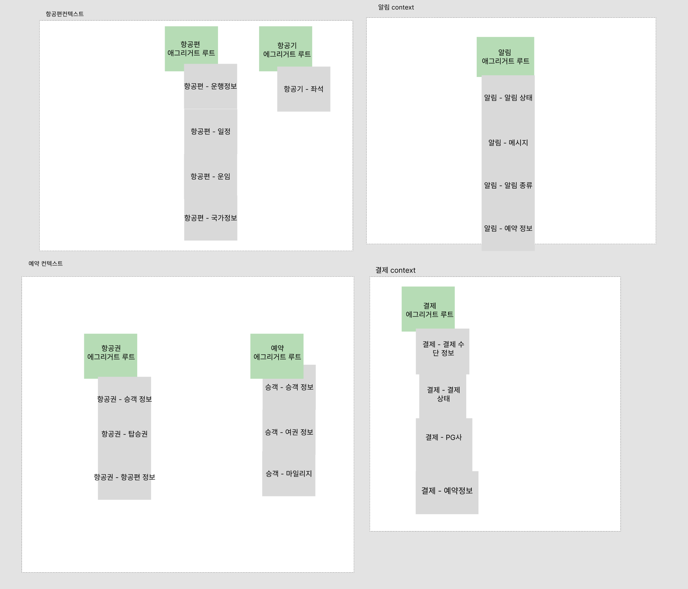

# 회고록

# **도메인 분석 및 언어 정의**

이번 프로젝트를 진행하면서 처음 정의한 용어 사전과 실제 코드 간의 일관성을 점검했습니다.

이때, 개발 과정에서 용어가 일부 불일치하거나 흐름에 따라 다른 표현이 사용되는 것을 확인했습니다. 예를 들어 결제 수단 정보는 용어 사전에서 Payment Method Info였지만 코드에서는 `PaymentMethod`로 구현되었고, PG사는 PG로 정의되었지만 코드에서는 `PGProvider`로 작성되었습니다. 또한 재발행은 사전에 Reissue로 정의했으나 코드에서는 `AirTicket.issue()`로 구현되는 형태를 택했습니다.

직접 코드를 작성하면서 용어에 상태 정보를 포함할 필요가 있음을 느꼈고, 정보 관련 용어에 `Info`를 붙이는 규칙과 항공편 운항 정보(`FlightOperation`)를 통일하는 기준이 더 필요하다는 점을 깨달았습니다. 개발을 통해 더 세밀한 용어 정의의 중요성을 실감했습니다.

---

# **경계 설정 및 구조화**

## 1. 도메인 문제

### **논의 사항**

> 승객 관리는 Core 인가? 혹은 Generic, Supporting 에 해당하는가?
>

### **논의 과정**

<aside>

**의견 1**

- 승객 관리는 타 회사에 외주를 줄 수 있는 도메인이라기 보다 자회사에서 다루어야 할 도메인이기때문에 Core 에 해당한다.

**의견 2**

- 승객 관리는 우리 회사만이 가지고 있는 차별적인 핵심 비즈니스 영역이라기보다 핵심 비즈니스(항공권 예약)을 하기 위한 부가적인 기능이므로 Core 가 아닌 Generic, Supporting 에 해당한다.

**의견 3**

- 승객 관리는  예약이라는 핵심 비즈니스 영역에서 필요한 일부 정보이고 현재 서비스 상황상 승객에게만 적용되는 별도의 비즈니스 규칙이나 로직, 서비스 항목이 많지 않아 Core로 승격시키기엔 다소 부실해 보이기 때문에 예약관리를 돕는 Supporting에 해당한다.
</aside>

### 판단 기준

<aside>

비회원도 사용 가능한 서비스, 승객 서비스가 제공하는 비즈니스의 규모

</aside>

### **결론**

<aside>

승객은 현재 시점에서 Core로 분류하기엔 예약을 보조하는 역할이 메인이기 때문에 우선 Supporting으로 분류하고 추후 확장되어 비즈니스 규모가 커질 경우 Core로 승격하도록 여지를 남김

</aside>

---

## 2. 경계 문제

### **논의 사항 1**

> 항공권 발권이 어떤 컨텍스트에 포함되어야 하는지(예약 vs 결제) 경계문제
>

### **논의 과정**

<aside>

**의견 1** - 항공권 발권은 예약 컨텍스트에 들어가야 한다.

- 항공권 발권 자체는 예약과 강한 결합(예약 변경시 항공권 변경 필요)이라고 생각되어 예약 컨텍스트로 들어가야함

**의견 2** - 항공권 발권은 별도 컨텍스트 존재 혹은 결제 컨텍스트에 들어가야함함

- 항공권 발권은 발권 자체로 도메인 규칙이 존재하므로 별도로 존재해야한다.
- 예약 혹은 결제 컨텍스트로 들어간다면 예약 → 결제 → 항공권 발급의 순서와 결제직후 항공권이 발권되므로 결제 컨텍스트에 들어가야한다.
</aside>

### 판단 기준

<aside>

어떤 팀이 어떤 기능을 관리하는게 비즈니스상 자연스러운가?

</aside>

### 결론

<aside>

컨텍스트는 00팀이 관리하는 서비스라고 생각했을때, ‘결제팀이 항공권 발권을 책임진다.’ 보다 ‘예약팀이 항공권 발권을 책임진다.’가 더  자연스럽기 때문에

**항공권 발권은 예약 컨텍스트에 Aggregate 로 존재해야한다.**

</aside>

---

### **논의 사항 2**

> 알림, 예약 간의 관계 논의 Conformist vs Cus/Sup
>

### 논의 과정

<aside>

**의견 1**

- 알림은 예약에게 기능을 제공하기 때문에 알림쪽이 Upstream이 되어야한다.

**의견 2**

- 예약이 완료되어야 관련된 예약정보가 알림 Context에게 데이터를 제공해 예약이 Upstream쪽이 되어야한다.
</aside>

### 결론

<aside>

알림은 예약이 어떤 기능을 하던 몰라도 되기 때문에 알림이 Upstream 이다.

</aside>

---

# **도메인 모델 코드 구현 및 서비스 계층 설계**

<aside>

- Domain Service 의 역할에 대해 고민했었고, 비즈니스 규칙과 관련된 도메인 규칙을 정의한다는것을 느낌
- 각자 작성하고 나니 컨벤션으로 정해야 할 규칙이 생각보다 더 많고 구체적이어야 한다는걸 느낌
- 서비스간 호출에 주고받을 데이터 규격을 컨텍스트 맵에 정의된 관계를 참고하여 정해야한다는 걸 느낌
- 어그리거트 루트를 이용해서 하다보니 자연스럽게 테이블 분리 생각보단 VO만 분리해 테이블이 비대해지는 경우가 있을 수 있다는 걸 느낌
- 컨텍스트 맵을 보고 책임이 누구에게 있는지 명확하게 보인다고 생각함
- DDD와 클린 아키텍쳐를 동시에 고민하면서 보다 각 서비스와 계층이 독립적인 책임을 가지는 설계가 중요하다는 것을 느낌
</aside>

# 회고

- 각자 생각하는 Core, Supporting, Generic 의 기준이 달라서 의견이 엇갈렸고, 시작전 용어의 개념을 팀간에 공통화하고 시작하면 좋겠다고 생각함
- 정답이 없는 문제에 대해 무엇이 정답인가?를 계속 고민하고 당연히 의견이 팽팽하게 대립할 수 밖에 없는 내용에 대해 토론을 진행하다 보니 결론을 내지 못한 채 시간만 소비하여 피로도가 증가했었음
- 정답이 없는 논의에는 **타임박스를 설정**(예: 30분 내 결론)하여 피로도를 관리하기로 함
- **시각 자료(Figma 등)를 초반부터 적극 활용**하면 추상적 개념을 구체화하고 커뮤니케이션 효율을 높일 수 있음을 알게됨

  

---